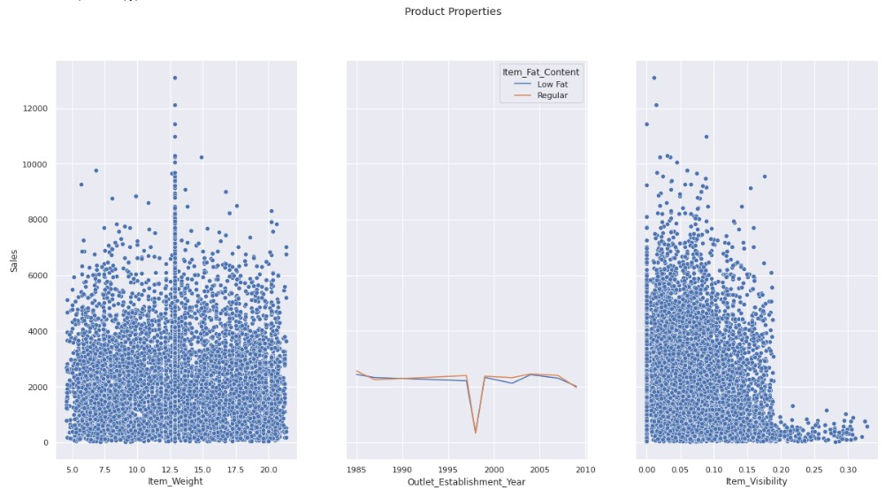

# Food Sales Prediction for Supermarket

## Data analysis including exploratory analysis, data viz and predictions using Regression Models

### Author Jose Herrera

### Business Problem

Sales prediction for food items sold at various stores

### Data
Data provided by Coding Dojo  
(8523, 12) obs  
dtypes: float64(4), int64(1), object(7)

## Methods

First part of the analysis is data manipulation and exploration analysis including data viz  
(Week 1-4)

Second part of the analysis is creating the prediction models.  
(Week 5-6)  

* Transformers Used
  * For numerical features
    * Imputer-> mean
    * Standard scaler
  * For categorical features
    * Correct naming convention  
    * Imputer-> mode
    * Hot Enconder
    
* Two Prediction Models
  * Linear Regression
  * Decision Tree
 
 
 
 
 
 
## Results
Exploratory Analysis

**Average Sale per Outlet Type**
 
 
 **Sales per Category and Outlet Type**
 
  
 
  Stacked barplot showing sales contribution of each category per Outle Type, Snacks Foods and Fruits and Vegetables are the cateogries with the biggest percentages.
 
  **Features Analysis**
   
   
   Analysis of certain variables that may not be correlated to Sales and can be left out of the features dataframe when doing the regression models.  
   Item Weight certainly doesn't seem to be correlated sales. Item_Visibility and Item_Fat_Content will be evaluated in the regression model.
  
## Model
The model selected is a Decision Tree with a 5 level depth.

|Metrics | Test Data | Train Data |
| ------------- |:-------------:|:-------------:|
| MAE      | 738.34     | 762.58     |
| MSE      | 1118083.68     | 1172164.97     |
| RMSE      | 1057.39    | 1082.67     |
| R^2      | 0.59     | 0.6     |

The model is explaining around 60% of the variance in the target, RMSE is $1057 which considering the averages sales can give us a fair estimate of how sales may behave in the future.

## Recommendations
For this analysis only a linear regression and a decision tree were considered.  
Use other models(Random Forest, K-Neighbors) to verify if a better R^2 can be obtain.  

Analyze predictions to determine how maximize sales based in the current features.  

Deeper analysis of features that may not be correlated to the model can be done to simplify the model.

## Limitations & Next Steps
Due to the scope of the project only 2 models were tested. Using other models the predictions may be better
